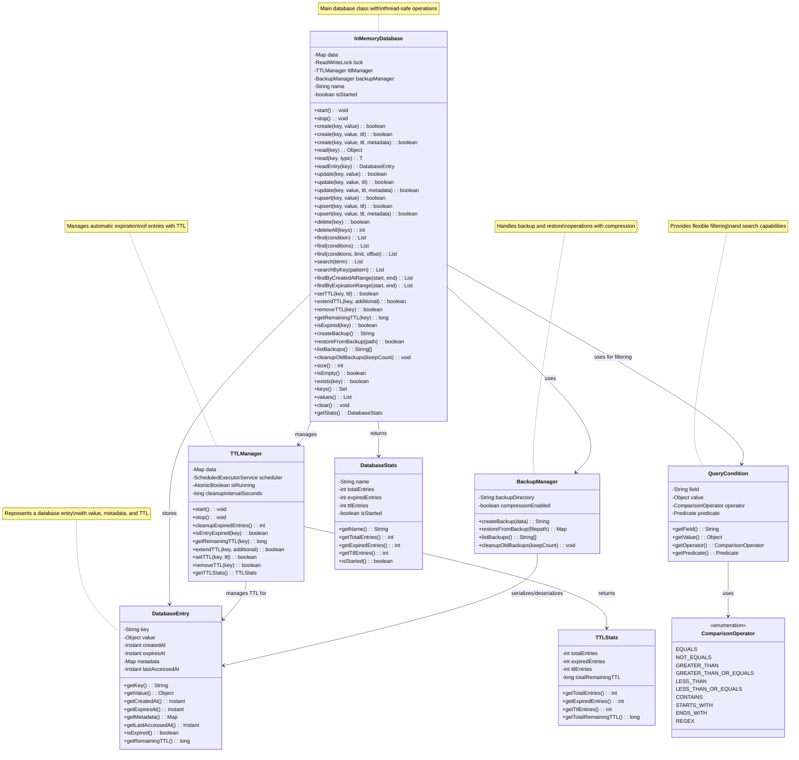
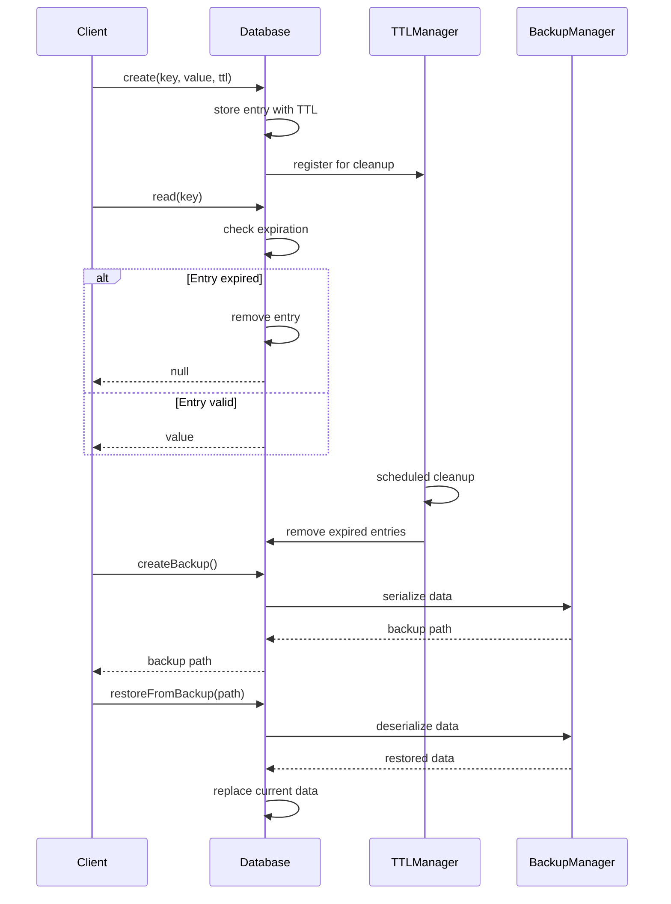
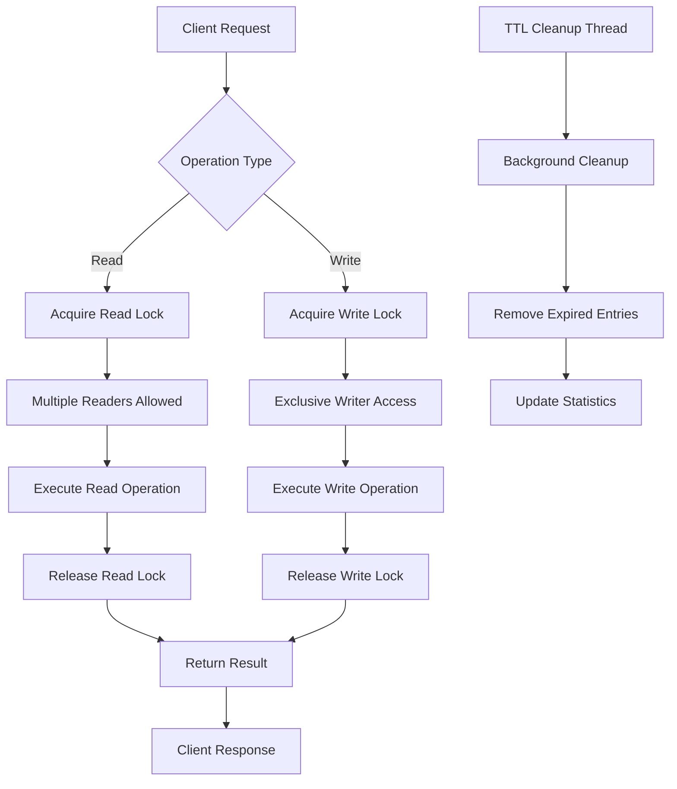

# In-Memory Database System - Class Diagram

## System Architecture



## Key Components

### 1. InMemoryDatabase
- **Main database class** providing all CRUD operations
- **Thread-safe** with read-write locks
- **Integrates** TTL management and backup functionality
- **Supports** advanced filtering and search operations

### 2. DatabaseEntry
- **Represents** a single database entry
- **Contains** key, value, timestamps, and metadata
- **Supports** TTL with automatic expiration checking
- **Tracks** access times for analytics

### 3. TTLManager
- **Manages** Time To Live functionality
- **Runs** background cleanup of expired entries
- **Provides** TTL operations (set, extend, remove)
- **Thread-safe** with scheduled executor

### 4. BackupManager
- **Handles** backup creation and restoration
- **Supports** compression for space efficiency
- **Manages** backup file lifecycle
- **Provides** backup listing and cleanup

### 5. QueryCondition
- **Enables** flexible filtering and search
- **Supports** multiple comparison operators
- **Allows** custom predicates for complex queries
- **Provides** type-safe query building

## Data Flow



## Thread Safety Model



## Memory Layout

```
InMemoryDatabase
├── ConcurrentHashMap<String, DatabaseEntry> data
├── ReentrantReadWriteLock lock
├── TTLManager ttlManager
└── BackupManager backupManager

DatabaseEntry
├── String key
├── Object value
├── Instant createdAt
├── Instant expiresAt
├── Map<String, Object> metadata
└── Instant lastAccessedAt

TTLManager
├── ScheduledExecutorService scheduler
├── AtomicBoolean isRunning
└── long cleanupIntervalSeconds

BackupManager
├── String backupDirectory
└── boolean compressionEnabled
```

## Performance Characteristics

- **Read Operations**: O(1) average case
- **Write Operations**: O(1) average case
- **Search Operations**: O(n) linear scan
- **TTL Cleanup**: O(n) periodic cleanup
- **Backup Operations**: O(n) serialization
- **Memory Usage**: O(n) where n is number of entries

## Scalability Considerations

- **Memory Bound**: Limited by available RAM
- **Concurrent Reads**: Multiple readers supported
- **Concurrent Writes**: Single writer at a time
- **TTL Overhead**: Background thread for cleanup
- **Backup Impact**: Blocks writes during backup
